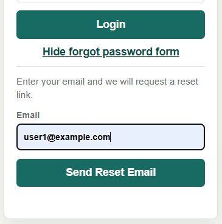

# Autenticación y gestión de contraseñas

Esta guía explica los flujos de login, cambio de contraseña y recuperación de contraseña.

La API utiliza:

- JWT para identificar usuarios autenticados.
- bcrypt para almacenar y comprobar contraseñas.
- Nodemailer para enviar el enlace temporal de recuperación.

## Endpoints

| Método | Endpoint | Función |
| --- | --- | --- |
| `POST` | `/api/v1/users/login` | Iniciar sesión |
| `GET` | `/api/v1/users/me` | Consultar el usuario autenticado |
| `PATCH` | `/api/v1/users/me/password` | Cambiar la contraseña |
| `POST` | `/api/v1/users/forgot-password` | Solicitar recuperación |
| `PATCH` | `/api/v1/users/reset-password/:token` | Establecer una nueva contraseña |

## Login

El usuario envía su email y contraseña:

```json
{
  "email": "user@example.com",
  "password": "password"
}
```

Si las credenciales son correctas, la API devuelve un JWT y los datos del usuario.

El token debe enviarse en las rutas protegidas:

```text
Authorization: Bearer <token>
```

`isAuth` verifica el token y coloca el usuario autenticado en `req.user`.

Las rutas administrativas utilizan además:

```js
requireRole('admin')
```

## Contraseñas

Las contraseñas se almacenan mediante bcrypt.

El modelo `User` comprueba si `password` ha sido modificada antes de generar un nuevo hash:

```js
if (!this.isModified('password')) return;
```

Esto evita volver a hashear una contraseña cuando se actualizan otros datos del usuario.

Las respuestas de la API no incluyen la contraseña.

## Cambio de contraseña

Un usuario autenticado puede cambiar su contraseña desde el perfil de la cuenta.

```text
PATCH /api/v1/users/me/password
```

Body:

```json
{
  "currentPassword": "current-password",
  "newPassword": "new-password",
  "confirmNewPassword": "new-password"
}
```

En el frontend, el usuario hace clic en "ME" y luego en _Change your password_.


El backend comprueba que:

- la contraseña actual sea correcta;
- las dos nuevas contraseñas coincidan;
- la nueva contraseña sea diferente de la actual.

La actualización general del perfil no permite modificar directamente `password`.

## Recuperación de contraseña

Si el usuario no recuerda su contraseña, puede solicitar un enlace de recuperación desde la pantalla de login.

```text
POST /api/v1/users/forgot-password
```

Body:

```json
{
  "email": "user@example.com"
}
```

El backend genera un token temporal de recuperación. El valor original se envía al usuario, mientras que MongoDB guarda solo el hash SHA-256 junto con la fecha de expiración.

El token tiene una validez de una hora y se construye con `APP_URL`:

```env
APP_URL=http://localhost:3000
```

Ejemplo:

```text
http://localhost:3000/?resetToken=<temporary-token>
```

En el frontend, el usuario despliega el formulario desde el enlace _Forgot your password_ bajo el botón de login.



La API responde con un mensaje genérico para no revelar si el correo existe o no en la base de datos.


## Correo de recuperación

Nodemailer envía un mensaje con el enlace temporal. Durante el desarrollo se utiliza una cuenta de prueba que permite abrir una vista previa del correo desde un enlace mostrado en la terminal.


Al seguir la URL se abre el correo de prueba con el token temporal.


## Restablecer la contraseña

Al abrir el enlace de recuperación entregado en el, el frontend obtiene `resetToken` de la URL y muestra el formulario para introducir la nueva contraseña.


En Insomnia, el token temporal se copia en la ruta para completar el cambio.


(Ver [pruebas-manuales-insomnia.md](./pruebas-manuales-insomnia.md) para más información)

El frontend envía:

```text
PATCH /api/v1/users/reset-password/:token
```

con:

```json
{
  "newPassword": "new-password",
  "confirmNewPassword": "new-password"
}
```

El backend:

1. genera el hash del token recibido;
2. busca el usuario asociado a ese hash;
3. comprueba que el token no haya expirado;
4. guarda la nueva contraseña.

Después del cambio, el usuario puede iniciar sesión normalmente con la nueva contraseña.


En otro entorno, este sistema de correo de prueba podría sustituirse por un servicio SMTP real.

## Flujo resumido

```text
POST /forgot-password
        ↓
generar token temporal
        ↓
guardar hash + expiración
        ↓
Nodemailer envía enlace
        ↓
APP_URL?resetToken=TOKEN
        ↓
usuario introduce nueva contraseña
        ↓
PATCH /reset-password/:token
        ↓
login con nueva contraseña
```

## Pruebas

### Cambio de contraseña

Puede probarse completamente desde Insomnia:

```text
login
  ↓
PATCH /users/me/password
  ↓
login con contraseña nueva
```

### Recuperación

El token debe obtenerse manualmente desde el correo o su previsualización:

```text
POST /users/forgot-password
        ↓
copiar token
        ↓
PATCH /users/reset-password/:token
        ↓
login con contraseña nueva
```

También puede probarse desde navegador abriendo directamente el enlace recibido.

La organización completa de las pruebas se encuentra en:

[pruebas-manuales-insomnia.md](pruebas-manuales-insomnia.md)