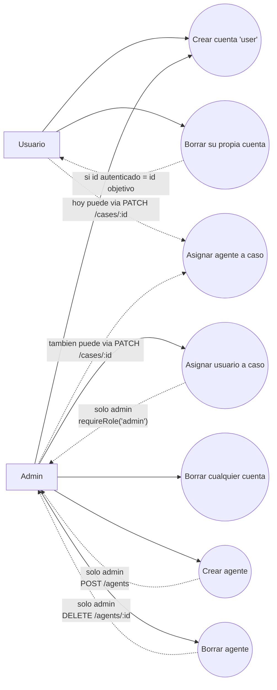

# Dev notes

Notas de implementacion y decisiones tecnicas del proyecto. Este archivo amplia detalles que en `docs/justificacion-requisitos.md` quedarian demasiado largos.

## Autenticacion y permisos

La autenticacion se maneja con JWT. Cuando un usuario hace login, `user.controller.js` genera un token con el id del usuario. En las rutas protegidas, `isAuth` verifica el token, busca el usuario en MongoDB y guarda ese usuario en `req.user`.

La autorizacion por rol se separa en `requireRole`. Este middleware recibe un rol requerido, por ejemplo `requireRole('admin')`, y comprueba que exista `req.user` y que su `role` coincida. Por eso siempre debe usarse despues de `isAuth`.

Ejemplo:

```js
usersRouter.patch('/:id/role', isAuth, requireRole('admin'), updateUserRole);
```

Esto deja claro que solo un usuario autenticado con rol admin puede cambiar roles.

## Registro y primer admin

El registro fuerza siempre `role: "user"` en el controller:

```js
newUser.role = 'user';
```

El primer admin se crea siguiendo el enunciado: se registra como usuario normal y luego se cambia manualmente su `role` a `"admin"` desde MongoAtlas.

No se seedean usuarios para evitar sobrescribir o borrar accidentalmente ese primer admin. Las semillas dependen de que exista un admin con el email esperado por `cases.seed.js`.

## Cambio de roles

El cambio de rol se separo en una ruta especifica:

```txt
PATCH /api/v1/users/:id/role
```

La decision se tomo para no mezclar la actualizacion normal del perfil con una accion sensible de permisos. `PUT /api/v1/users/:id` actualiza datos generales, pero elimina del body los campos sensibles:

```js
delete req.body.role;
delete req.body.assignedCases;
delete req.body.password;
```

Asi un usuario no puede elevar sus permisos, asignarse casos ni cambiar la contrasena desde la ruta general de actualizacion.

`updateUserRole` usa `runValidators: true` para que Mongoose valide el enum del modelo y solo acepte roles validos.

## Relacion entre Users y Cases

El requisito pide que `User` tenga un array con datos relacionados de otra coleccion y que no haya duplicados ni perdida de datos anteriores.

La relacion implementada es:

- `User.assignedCases`: array de referencias a `Case`.
- `Case.assignedTo`: array de referencias a `User`.

La asignacion se hace desde una ruta especifica de admin:

```txt
PUT /api/v1/cases/:caseId/assign/:userId
```

El controller `assignCaseToUser` actualiza ambos lados con `$addToSet`:

```js
{ $addToSet: { assignedTo: userId } }
{ $addToSet: { assignedCases: caseId } }
```

`$addToSet` evita duplicados y agrega sin borrar los valores existentes.

Para evitar que la asignacion se salte desde rutas generales:

- `postCase` elimina `assignedTo` y `createdBy` del body.
- `updateCase` elimina `assignedTo` y `createdBy` del body.
- `updateUser` elimina `assignedCases` del body.

## Limpieza de relaciones

Cuando se elimina un usuario, `deleteUser` usa `$pull` para quitar su id de `Case.assignedTo`. Luego elimina su imagen de Cloudinary y el documento de usuario.

Cuando se elimina un caso, `deleteCase` usa `$pull` para quitar el id del caso de `User.assignedCases`.

Esto evita referencias rotas en los arrays relacionados.

## Eliminacion de usuarios

La ruta de borrado no usa `requireRole('admin')` directamente porque el requisito permite dos casos:

- un usuario puede borrar su propia cuenta;
- un admin puede borrar cualquier cuenta.

Por eso la comprobacion vive en `deleteUser`. El controller calcula:

```js
const isAdmin = req.user.role === 'admin';
const isSameUser = req.user._id.toString() === id;
```

Si no es admin ni propietario de la cuenta, responde `403`.

## Cloudinary

El proyecto usa dos configuraciones de subida en `file.js`:

- `uploadUser`, que guarda imagenes en `userPortrait`;
- `uploadAgent`, que guarda imagenes en `agentPortrait`.

El campo usado por la API es `image`. En `multipart/form-data`, el archivo debe enviarse con ese nombre de campo.

Cuando se elimina un usuario o agente, se llama a `deleteFile`, que obtiene el `publicId` desde la URL y usa `cloudinary.uploader.destroy`.

## Passwords en respuestas

Las respuestas de usuario evitan devolver `password`:

- Las consultas usan `.select('-password')`.
- En registro y login se limpia `password` antes de responder.
- `isAuth` limpia `password` antes de guardar el usuario en `req.user`.

## Seeds

Las semillas se separaron por responsabilidad:

- `agents.data.js` contiene los datos base de agentes.
- `cases.data.js` contiene los datos base de casos, sin ids de MongoDB.
- `agents.seed.js` limpia e inserta agentes.
- `cases.seed.js` busca el admin y agentes ya insertados para construir relaciones.
- `index.seed.js` conecta a MongoDB y ejecuta las semillas en orden.

El orden es importante:

```txt
1. seed agents
2. seed cases
```

Los casos necesitan ids reales de agentes, por eso `cases.seed.js` se ejecuta despues de `agents.seed.js`.

`cases.data.js` no incluye `createdBy` ni `assignedAgents` porque esos valores dependen de documentos reales en MongoDB. Antes de insertar, `cases.seed.js` crea `casesWithRelations`, anadiendo:

- `createdBy: adminUser._id`
- `assignedAgents: [agentId, agentId]`

Asi los documentos cumplen el schema de `Case` al momento de insertarse.

## Agents y Books

El proyecto usa personajes de los libros sobre [la Guardia (City Watch)](https://en.wikipedia.org/wiki/Ankh-Morpork_City_Watch) del universo Discworld de Terry Pratchett.

Escogi este tema porque me resulta mas facil recordar lo que estoy probando al seguir la logica de las historias.

Lo ideal seria que usuarios y agentes fueran una sola coleccion, pero los requisitos del proyecto lo complican, porque el admin inicial debe crearse como user y luego modificarse manualmente en MongoDB, por lo que no puedo seedear usuarios. 

`Users` son asignados a casos por los `Admin` y entonces agregan los `Agentes` a los mismos. Podría entenderse que son los *Owners* del caso. 

`Agent` permite conservar referencias a personajes/agentes de la City Watch. Se usa tambien en las semillas y en la relacion `Case.assignedAgents`.

`Book` se conserva como material de referencia y consulta. Cualquier usuario puede hacer `GET`, pero crear, editar y borrar libros requiere autenticacion y rol admin. En un principio pensaba borrar esta coleccion, pero ya fue documentada e incluida en `docs/pruebas-manuales-insomnia.md`.

## Esquema (Mermaid)



Lectura rapida:

- Cualquier persona puede crear cuenta por register, pero siempre nace con role user.
- Un usuario autenticado puede borrar su propia cuenta.
- Solo admin puede asignar usuarios a casos.
- Admin tambien puede borrar cuentas de otros usuarios.
- Solo admin puede crear agentes y borrar agentes.
- Asignar agentes a casos hoy no tiene endpoint dedicado de admin: actualmente se puede enviar `assignedAgents` en `PATCH /cases/:id` (ruta autenticada, no restringida por rol).
- Esta combinacion refleja la regla de negocio actual: auto-gestion de cuenta para user, asignacion de usuarios reservada a admin, y asignacion de agentes pendiente de endurecer si se quiere regla estricta de admin.
