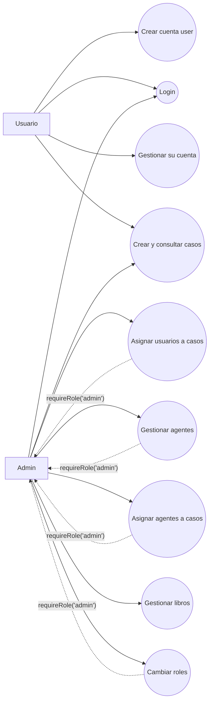

# Dev notes

Este archivo recoge las decisiones técnicas, reglas de negocio y notas de implementación del proyecto. Aquí se documenta por qué se hizo cada elección y cómo encaja con los requisitos del backend.

No es un README general ni una guía de usuario; para eso están el README principal y los documentos específicos de cada tema dentro de `docs/`.

## Autenticacion y permisos

La autenticacion se maneja mediante JWT.

Cuando un usuario hace login, `user.controller.js` valida las credenciales y genera un token que contiene el id del usuario.

En las rutas protegidas, `isAuth`:

1. obtiene el token del header `Authorization`;
2. verifica el JWT;
3. obtiene el id del usuario;
4. busca el usuario en MongoDB;
5. guarda ese usuario en `req.user`.

El token se envia como:

```text
Authorization: Bearer <token>
```

La autorizacion por rol se separa en `requireRole`.

Este middleware recibe el rol requerido, por ejemplo:

```js
requireRole('admin')
```

y comprueba que exista `req.user` y que su `role` coincida.

Por eso debe utilizarse despues de `isAuth`.

Ejemplo:

```js
usersRouter.patch('/:id/role', isAuth, requireRole('admin'), updateUserRole);
```

El login, cambio de contraseña y recuperacion de contraseña estan documentados con mas detalle en:

[autenticacion-y-passwords.md](autenticacion-y-passwords.md)

## Registro y primer admin

El registro fuerza siempre `role: "user"` en el controller:

```js
newUser.role = 'user';
```

El primer admin se crea siguiendo el enunciado: se registra como usuario normal y luego se cambia manualmente su `role` a `"admin"` desde MongoAtlas.

No se seedean usuarios para evitar sobrescribir o borrar accidentalmente ese primer admin. Las semillas dependen de que exista un admin con el email esperado por `cases.seed.js`.

## Gestion de contraseñas

La actualizacion normal de un usuario no permite modificar `password`.

El cambio de contraseña tiene una ruta especifica:

```text
PATCH /api/v1/users/me/password
```

Esta ruta requiere autenticacion y comprueba la contraseña actual antes de permitir el cambio.

El modelo `User` utiliza un hook `pre('save')` para aplicar bcrypt. El hook comprueba primero:

```js
if (!this.isModified('password')) return;
```

Esto evita volver a hashear una contraseña que no ha cambiado.

La recuperacion de contraseña utiliza:

```text
POST  /api/v1/users/forgot-password
PATCH /api/v1/users/reset-password/:token
```

El token original se envia al usuario, pero MongoDB almacena solamente su hash SHA-256.

El token expira despues de una hora.

Los campos:

```text
resetPasswordToken
resetPasswordExpires
```

tienen `select: false` en el modelo y no se incluyen en las consultas normales.

El envio del enlace se realiza mediante Nodemailer.

Sin una configuracion SMTP completa, `sendResetPasswordEmail.js` crea una cuenta temporal de prueba y muestra en consola la URL desde la que se puede previsualizar el correo.

La implementacion completa se explica en:

[autenticacion-y-passwords.md](autenticacion-y-passwords.md)


## Relacion entre Users y Cases

El requisito pide que `User` tenga un array con datos relacionados de otra coleccion y que no haya duplicados ni perdida de datos anteriores.

La relacion implementada es:

- `User.assignedCases`: array de referencias a `Case`.
- `Case.assignedTo`: array de referencias a `User`.

La asignacion se hace desde una ruta especifica de admin:

```txt
PUT /api/v1/cases/:caseId/assign/:userId
```

El controller `assignCaseToUser` actualiza ambos lados con `$addToSet`:

```js
{ $addToSet: { assignedTo: userId } }
{ $addToSet: { assignedCases: caseId } }
```

`$addToSet` evita duplicados y agrega sin borrar los valores existentes.

Para evitar que la asignacion se salte desde rutas generales:

- `postCase` elimina `assignedTo` y `createdBy` del body.
- `updateCase` elimina `assignedTo` y `createdBy` del body.
- `updateUser` elimina `assignedCases` del body.

## Limpieza de relaciones

Cuando se elimina un usuario, `deleteUser` usa `$pull` para quitar su id de `Case.assignedTo`. Luego elimina su imagen de Cloudinary y el documento de usuario.

Cuando se elimina un caso, `deleteCase` usa `$pull` para quitar el id del caso de `User.assignedCases`.

Esto evita referencias rotas en los arrays relacionados.

## Eliminacion de usuarios

La ruta de borrado no usa `requireRole('admin')` directamente porque el requisito permite dos casos:

- un usuario puede borrar su propia cuenta;
- un admin puede borrar cualquier cuenta.

Por eso la comprobacion vive en `deleteUser`. El controller calcula:

```js
const isAdmin = req.user.role === 'admin';
const isSameUser = req.user._id.toString() === id;
```

Si no es admin ni propietario de la cuenta, responde `403`.

## Cloudinary

El proyecto usa dos configuraciones de subida en `file.js`:

- `uploadUser`, que guarda imagenes en `userPortrait`;
- `uploadAgent`, que guarda imagenes en `agentPortrait`.

El campo utilizado por la API es:

```text
image
```

Por tanto, en `multipart/form-data` el archivo debe enviarse con ese nombre.

Cuando se crea un `User` o `Agent`, la URL proporcionada por Cloudinary se guarda en el campo `image` del documento.

Cuando una operacion falla despues de haber subido una imagen nueva, los controllers utilizan funciones de rollback para intentar eliminar de Cloudinary ese archivo y evitar imagenes huerfanas.

Al actualizar una imagen de usuario o agente, la nueva URL debe quedar almacenada en MongoDB y la imagen anterior debe eliminarse despues de que la actualizacion haya terminado correctamente.

Cuando se elimina un usuario o agente, se llama a `deleteFile`, que obtiene el `publicId` desde la URL y utiliza:

```js
cloudinary.uploader.destroy(...)
```

Las operaciones relacionadas con Cloudinary tambien se comprueban manualmente durante las pruebas de Insomnia porque el resultado debe verificarse tanto en MongoDB como en el almacenamiento externo.

## Passwords en respuestas

Las respuestas de usuario evitan devolver `password`:

- Las consultas usan `.select('-password')`.
- En registro y login se limpia `password` antes de responder.
- `isAuth` limpia `password` antes de guardar el usuario en `req.user`.

## Seeds

Las semillas se separaron por responsabilidad:

- `agents.data.js` contiene los datos base de agentes.
- `cases.data.js` contiene los datos base de casos, sin ids de MongoDB.
- `agents.seed.js` limpia e inserta agentes.
- `cases.seed.js` busca el admin y agentes ya insertados para construir relaciones.
- `index.seed.js` conecta a MongoDB y ejecuta las semillas en orden.

El orden es importante:

```txt
1. seed agents
2. seed cases
```

Los casos necesitan ids reales de agentes, por eso `cases.seed.js` se ejecuta despues de `agents.seed.js`.

`cases.data.js` no incluye `createdBy` ni `assignedAgents` porque esos valores dependen de documentos reales en MongoDB. Antes de insertar, `cases.seed.js` crea `casesWithRelations`, anadiendo:

- `createdBy: adminUser._id`
- `assignedAgents: [agentId, agentId]`

Asi los documentos cumplen el schema de `Case` al momento de insertarse.

## Agents y Books

El proyecto usa personajes de los libros sobre [la Guardia (City Watch)](https://en.wikipedia.org/wiki/Ankh-Morpork_City_Watch) del universo Discworld de Terry Pratchett.

Escogi este tema porque me resulta mas facil recordar lo que estoy probando al seguir la logica de las historias.

Lo ideal seria que usuarios y agentes fueran una sola coleccion, pero los requisitos del proyecto lo complican porque el admin inicial debe crearse como `User` y despues modificarse manualmente en MongoDB. Por esa razon no se seedean usuarios.

Los `Users` representan a los usuarios de la aplicacion y pueden ser asignados a casos.

Los `Agents` representan personajes de la City Watch y se relacionan con los casos mediante `Case.assignedAgents`.

La asignacion y desasignacion de agentes a casos utiliza endpoints dedicados:

```text
PUT /api/v1/cases/:caseId/assign-agent/:agentId
PUT /api/v1/cases/:caseId/unassign-agent/:agentId
```

Ambos requieren:

```text
isAuth
requireRole('admin')
```

`Book` se conserva como material adicional de referencia y relaciona libros con agentes.

La lectura de la lista de libros es publica. Las operaciones principales de creacion, actualizacion y borrado requieren rol admin.

## Esquema (Mermaid)


```mermaid
flowchart LR
    U[Usuario]
    AD[Admin]

    UC1((Crear cuenta user))
    UC2((Login))
    UC3((Gestionar su cuenta))
    UC4((Crear y consultar casos))
    UC5((Asignar usuarios a casos))
    UC6((Gestionar agentes))
    UC7((Asignar agentes a casos))
    UC8((Gestionar libros))
    UC9((Cambiar roles))

    U --> UC1
    U --> UC2
    U --> UC3
    U --> UC4

    AD --> UC2
    AD --> UC4
    AD --> UC5
    AD --> UC6
    AD --> UC7
    AD --> UC8
    AD --> UC9

    UC5 -. "requireRole('admin')" .-> AD
    UC6 -. "requireRole('admin')" .-> AD
    UC7 -. "requireRole('admin')" .-> AD
    UC9 -. "requireRole('admin')" .-> AD
```

Lectura rapida:

- Cualquier persona puede registrarse, pero toda cuenta nueva nace con `role: "user"`.
- Un usuario puede iniciar sesion y consultar su propio perfil.
- Un usuario autenticado puede cambiar su propia contraseña.
- Un usuario puede borrar su propia cuenta.
- Un admin puede borrar cuentas de otros usuarios.
- Solo admin puede cambiar roles.
- Solo admin puede asignar usuarios a casos.
- La asignacion y desasignacion de agentes a casos utiliza endpoints dedicados protegidos para admin.
- Crear, actualizar y borrar agentes requiere admin.
- Crear, actualizar y borrar libros requiere admin.


## Historial de depuracion de imagenes

Durante el desarrollo se detectaron problemas en actualizaciones de agentes relacionados con operaciones fallidas y archivos que ya habian sido subidos a Cloudinary.

Como resultado se añadieron mecanismos de rollback para intentar eliminar una imagen nueva cuando la operacion de base de datos no puede completarse.

La documentacion principal describe ahora el comportamiento esperado y no depende de los archivos temporales utilizados durante el proceso de debug.

## Revision final antes de entrega

Durante la ultima ronda de validacion se revisaron los puntos que en una fase anterior estaban marcados como pendientes. Todos los cambios relevantes ya quedaron resueltos en el codigo o en la documentacion tecnica.

### Verificaciones completadas

#### Creacion y duplicados en cases

Se reviso la logica de `updateCase` y se aplico la misma politica de validacion que en la creacion:

- se valida que `title` sea un string;
- se normaliza el texto antes de guardarlo;
- se evita la duplicacion por comparacion case-insensitive;
- se bloquea la actualizacion de relaciones protegidas (`assignedTo`, `createdBy`) desde rutas generales.

#### Validacion de IDs

El middleware `validateObjectId` ya se usa en las rutas que reciben identificadores, con una politica consistente:

```text
ID mal formado              -> 400
ID valido pero inexistente  -> 404
```

Esto aplica a las rutas de `agents`, `books`, `cases` y `users` cuando reciben parametros de MongoDB.

#### Permisos en la relacion Book-Agent

La ruta para anadir un agente a un libro quedo protegida con `requireRole('admin')`:

```text
PUT /api/v1/books/:bookId/agents/:agentId
```

La eliminacion del agente del libro ya requería admin y la regla ahora es consistente entre ambas operaciones.

#### Limpieza de codigo

Se eliminaron logs temporales de depuracion y comentarios de trabajo en curso que no correspondian al estado final del proyecto.

Esto incluye la limpieza de la depuracion de password reset y de la eliminacion de archivos en Cloudinary.

#### Pruebas de cierre

Antes de cerrar la entrega, conviene verificar lo siguiente:

- ausencia de recursos temporales;
- ausencia de imagenes huerfanas en Cloudinary;
- limpieza correcta de relaciones;
- comportamiento correcto de IDs invalidos e inexistentes;
- rechazo de duplicados;
- funcionamiento de login, cambio y recuperacion de contraseña.

La documentacion principal de requisitos puede marcarse como cerrada una vez se complete esta comprobacion final en entorno real y se confirme el resultado de las pruebas de la API.
